# Houselytics

Houselytics is a predictive analytics dashboard built with **Python**, **Streamlit**, and **scikit-learn** to analyse housing value drivers and estimate house sale prices in **Ames, Iowa, USA**.

The project was developed around a business-focused client scenario in which **Lydia Doe** needs support in understanding the local Ames housing market before valuing and potentially selling four inherited properties. The dashboard combines **data analysis**, **interactive visualisations**, and a **trained regression model** to support better pricing decisions.

---

## Live Project

- **Live Application:** [Houselytics on Heroku](https://damp-anchorage-27661-879f654c9367.herokuapp.com/)
- **GitHub Repository:** [boneyphilip/houselytics](https://github.com/boneyphilip/houselytics)

---

## Table of Contents

- [Houselytics](#houselytics)
  - [Live Project](#live-project)
  - [Table of Contents](#table-of-contents)
  - [Project Overview](#project-overview)
  - [Business Understanding](#business-understanding)
    - [Client Background](#client-background)
    - [Problem Statement](#problem-statement)
    - [Stakeholders](#stakeholders)
    - [Project Goals](#project-goals)
  - [Business Requirements](#business-requirements)
  - [User Stories](#user-stories)
  - [Rationale to Map Business Requirements to Data Visualisations and ML Tasks](#rationale-to-map-business-requirements-to-data-visualisations-and-ml-tasks)
  - [Machine Learning Business Case](#machine-learning-business-case)
  - [Project Hypotheses and Validation](#project-hypotheses-and-validation)
  - [Dataset Content](#dataset-content)
  - [CRISP-DM Alignment](#crisp-dm-alignment)
  - [Data Collection, Cleaning, and Preparation](#data-collection-cleaning-and-preparation)
  - [Exploratory Data Analysis Findings](#exploratory-data-analysis-findings)
  - [Modeling Approach](#modeling-approach)
    - [Baseline Model Comparison](#baseline-model-comparison)
    - [Final Model Selection](#final-model-selection)
    - [Hyperparameter Tuning Strategy](#hyperparameter-tuning-strategy)
    - [Final Model Performance](#final-model-performance)
  - [Dashboard Design](#dashboard-design)
    - [Navigation](#navigation)
    - [Page 1: Project Summary](#page-1-project-summary)
    - [Page 2: Project Hypothesis and Validation](#page-2-project-hypothesis-and-validation)
    - [Page 3: Data Insights](#page-3-data-insights)
    - [Page 4: Property Valuation Tool](#page-4-property-valuation-tool)
    - [Page 5: Model Performance](#page-5-model-performance)
  - [Key Features](#key-features)
  - [Future Enhancements](#future-enhancements)
  - [Technologies Used](#technologies-used)
  - [Project Structure](#project-structure)
    - [Folder and File Purpose](#folder-and-file-purpose)
  - [Testing and Validation](#testing-and-validation)
    - [Manual Testing](#manual-testing)
    - [Notebook Validation](#notebook-validation)
    - [Code Quality Checks](#code-quality-checks)
    - [Known Limitations](#known-limitations)
  - [Deployment](#deployment)
    - [Heroku Deployment](#heroku-deployment)
    - [Local Development](#local-development)
  - [Credits](#credits)
  - [Acknowledgements](#acknowledgements)
  - [Final Conclusion](#final-conclusion)

---

## Project Overview

Houselytics is a **real-world predictive analytics application** designed to address a property valuation problem using machine learning.

The dashboard serves two main purposes:

1. **Explain which house features influence sale price** through visual analysis and interactive exploration.
2. **Predict sale prices** for:
   - Lydia Doe’s four inherited houses.
   - Any other house in Ames, Iowa entered by the user.

This project was built as a predictive analytics solution that combines:

- Business understanding.
- Tabular data analysis.
- Feature engineering.
- Supervised machine learning.
- Interactive dashboard design.
- Cloud deployment.

The final result is a dashboard that supports a **non-technical end user** while also demonstrating a clear data science workflow.

---

## Business Understanding

### Client Background

Lydia Doe has inherited four houses located in **Ames, Iowa, USA**. Although she has good knowledge of property values in her home country, she does not have enough confidence in the **local Ames housing market** to estimate the value of these properties accurately.

Because of this, she risks:

- **Underpricing** the houses and losing money.
- **Overpricing** the houses and reducing buyer interest.
- Making valuation decisions based on assumptions rather than evidence.

### Problem Statement

The core business problem is that the client needs a reliable and evidence-based way to:

- Understand which features drive house sale prices in Ames, Iowa.
- Estimate the value of her inherited properties.
- Generate future sale price predictions for other houses in the same market.

Without a structured data-driven solution, pricing decisions would rely too heavily on intuition and could lead to poor financial outcomes.

### Stakeholders

- **Primary Stakeholder:** Lydia Doe.
- **Secondary Stakeholders:** Future property owners, property advisors, and non-technical users who want valuation guidance based on historical data.

### Project Goals

The main goals of Houselytics are:

- To analyse historical housing data and identify key value drivers.
- To validate business-focused pricing hypotheses.
- To build a trained machine learning model for sale price prediction.
- To present the results in a professional, easy-to-use dashboard.
- To support both single-property and portfolio-level appraisal decisions.

---

## Business Requirements

### Business Requirement 1: Data Analysis

The client wants to understand how house attributes relate to `SalePrice` in the Ames housing market.

This requirement is met by:

- Correlation analysis.
- Feature exploration.
- Interactive visualisations.
- Hypothesis-driven validation.

### Business Requirement 2: Predictive System

Lydia Doe wants to estimate the sale price of her four inherited houses and predict the sale price of any other house in Ames, Iowa using a trained regression model.

This requirement is met by:

- A supervised machine learning regression model.
- A quick estimate workflow.
- A more detailed valuation workflow.
- An inherited portfolio appraisal workflow.

---

## User Stories

The business requirements were translated into user-focused stories to guide the dashboard design and development process.

- **As a client**, I want to understand which house features influence sale price so that I can make better pricing decisions.
- **As a client**, I want to estimate the value of my inherited houses so that I can avoid underpricing or overpricing them.
- **As a future property owner**, I want to enter house attributes and receive an estimated sale price so that I can make informed financial decisions.
- **As a non-technical user**, I want a clear dashboard structure so that I can understand both the data insights and the prediction results without needing technical knowledge.
- **As a decision-maker**, I want to see evidence that the model performs well so that I can trust the pricing guidance provided by the system.

---

## Rationale to Map Business Requirements to Data Visualisations and ML Tasks

The project was designed so that each business requirement is directly supported by a clear technical task.

| Business Requirement | Technical Task Type | Implementation |
|---|---|---|
| Understand price drivers in Ames, Iowa | Data analysis and data visualisation | Correlation analysis, scatter plots, box plots, interactive feature exploration, and insight summaries. |
| Estimate sale prices for Lydia’s inherited houses | Supervised machine learning (regression) | A trained and tuned regression model used for batch portfolio predictions. |
| Predict sale prices for any other house in Ames, Iowa | Supervised machine learning (regression) | Quick Estimate and Detailed Analysis user input workflows. |

### Why This Mapping Is Appropriate

- **Business Requirement 1** is analytical in nature, so it is best answered through visual and statistical exploration of historical housing data.
- **Business Requirement 2** is predictive in nature, so it is best answered through a trained machine learning model capable of producing numerical sale price estimates.

### ML Task

The predictive task in this project is a **supervised machine learning regression task**, because:

- The target variable is numeric (`SalePrice`).
- The system learns patterns from labelled historical examples.
- The model outputs a continuous numerical value rather than a category label.

---

## Machine Learning Business Case

### Predictive Objective

The objective of the machine learning system is to estimate the sale price of houses in Ames, Iowa based on property attributes.

### Learning Method

This project uses **supervised learning** because the dataset contains historical examples where the target (`SalePrice`) is already known.

### Why Regression Is Appropriate

Regression is appropriate because the output is a **continuous numerical value** representing a property’s estimated sale price.

### Model Inputs

The model uses engineered and cleaned housing features, including examples such as:

- `OverallQual`
- `OverallCond`
- `GrLivArea`
- `GarageArea`
- `LotArea`
- `TotalBsmtSF`
- `YearBuilt`
- `YearRemodAdd`
- `BedroomAbvGr`

### Model Output

The output is a **predicted market value in US dollars**.

### Success Metrics

The project evaluates model success using:

- **R²** to measure explained variance.
- **MAE** to measure average absolute prediction error.
- **RMSE** to penalise larger errors more strongly.

### Ideal Outcome

The ideal outcome is a model that:

- Performs strongly on unseen test data.
- Generalises well.
- Provides practical pricing guidance for the user.
- Produces useful predictions that support decision-making.

### Failure Condition

The predictive system would be considered weak if:

- Test performance was poor.
- Train and test performance were badly misaligned.
- Prediction error was too high for practical use.
- Outputs were not stable enough to support pricing decisions.

### Business Relevance

The model is not intended to replace a final professional valuation. Instead, it is designed to provide **structured data-driven pricing guidance** that helps reduce uncertainty.

---

## Project Hypotheses and Validation

Three business-focused hypotheses were defined and tested using visual analysis and correlation-based validation.

### Hypothesis 1: Construction Quality

**Hypothesis:** Houses with higher quality scores (`OverallQual`) tend to have higher sale prices.

**Validation Method:**

- Box plot review.
- Pearson correlation between `OverallQual` and `SalePrice`.

**Conclusion:**  
The relationship is strongly positive. Higher construction quality is clearly associated with higher sale prices.

**Business Takeaway:**  
Construction quality should be treated as a major value driver when estimating realistic sale price.

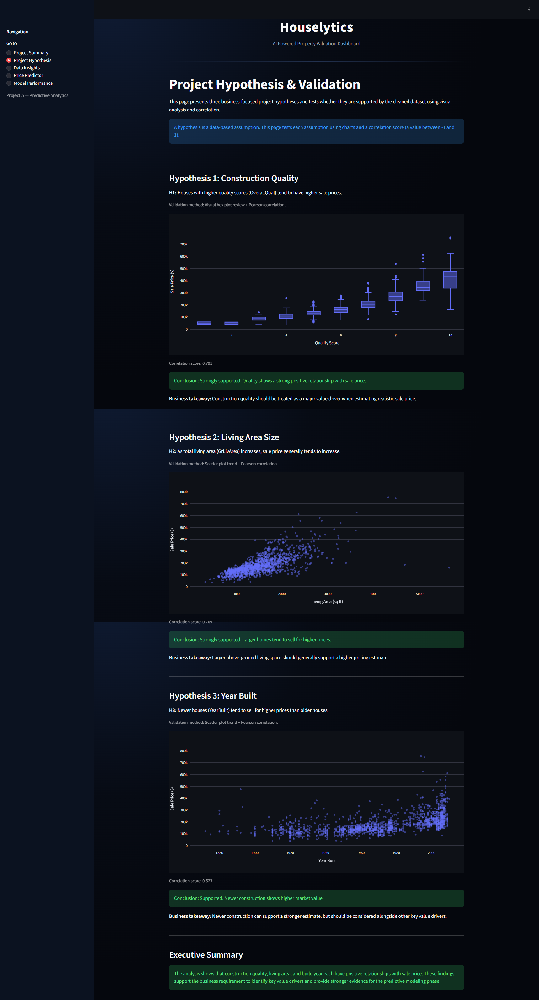

---

### Hypothesis 2: Living Area Size

**Hypothesis:** As total living area (`GrLivArea`) increases, sale price generally increases.

**Validation Method:**

- Scatter plot trend analysis.
- Pearson correlation between `GrLivArea` and `SalePrice`.

**Conclusion:**  
The relationship is strongly positive. Larger houses generally sell for higher prices.

**Business Takeaway:**  
Above-ground living space is one of the most important indicators when estimating price.

---

### Hypothesis 3: Year Built

**Hypothesis:** Newer houses (`YearBuilt`) tend to sell for higher prices than older houses.

**Validation Method:**

- Scatter plot trend analysis.
- Pearson correlation between `YearBuilt` and `SalePrice`.

**Conclusion:**  
A positive relationship is present. Newer construction tends to support higher market value, although age should still be considered together with quality and size.

**Business Takeaway:**  
Year built contributes to pricing, but should be assessed alongside other key value drivers.

---

## Dataset Content

This is a **tabular dataset** based on historical housing records for Ames, Iowa.

### Main Dataset

- **Training Dataset:** Historical housing records.
- **Target Variable:** `SalePrice`.
- **Data Type:** Structured tabular data.
- **Use Case:** Learning the relationship between house attributes and final sale prices.

### Inherited Houses Dataset

A second dataset contains Lydia’s four inherited houses, which are used as an example portfolio for batch valuation.

### Key Characteristics

- Numerical features and encoded ordinal-style features.
- Property size features.
- Property quality and condition features.
- Construction and remodelling year features.
- A target variable for supervised learning.

The processed training dataset used in the application is stored as:

- `data/processed/clean_train.csv`

The inherited houses sample data is stored as:

- `data/raw/inherited_houses.csv`

---

## CRISP-DM Alignment

The project follows the logic of the **CRISP-DM** framework.

### 1. Business Understanding

The client problem was defined first: identify value drivers and estimate house prices in Ames, Iowa.

### 2. Data Understanding

The dataset was explored to understand:

- Structure.
- Missing values.
- Feature types.
- Target distribution.
- Likely high-impact variables.

### 3. Data Preparation

The data was cleaned, missing values were handled, and categorical-style features were encoded to support modeling.

### 4. Modeling

Multiple regression models were compared, then a final model was selected and tuned.

### 5. Evaluation

The model was evaluated using R², MAE, RMSE, and visual diagnostics.

### 6. Deployment

The model was embedded in a Streamlit dashboard and deployed to Heroku.

---

## Data Collection, Cleaning, and Preparation

### Data Collection

The project uses a provided housing dataset and a separate inherited-houses file to simulate the client’s portfolio use-case.

### Data Understanding

The first stage of notebook work focused on:

- Understanding the structure of the dataset.
- Confirming target availability.
- Identifying missing values.
- Reviewing feature types.
- Reviewing the spread of `SalePrice`.

### Data Cleaning

The cleaning stage used domain-aware handling:

- Missing categorical values representing absence were filled with `"None"`.
- Absence-based numeric features were filled with `0`.
- Measurement-based missing values were filled using the **median** to reduce distortion from outliers.

This approach preserved practical meaning while keeping the dataset model-ready.

### Feature Engineering

To support machine learning, the data was transformed into a fully numeric format.

This included:

- Ordinal encoding of relevant features.
- Aligning the feature set used by the final model.
- Ensuring consistent feature structure for dashboard input frames.

### Preparation Outcome

The final output of the preparation stage was a cleaned, numeric dataset suitable for:

- Analysis.
- Model training.
- Dashboard predictions.

---

## Exploratory Data Analysis Findings

The data analysis stage was designed to answer **Business Requirement 1**.

### Key Findings

- `SalePrice` is **right-skewed**, meaning most houses are in the lower to mid-price range, with fewer high-value outliers.
- Strong positive relationships are visible between `SalePrice` and:
  - `OverallQual`
  - `GrLivArea`
  - `TotalBsmtSF`
- These variables are among the strongest value drivers in the Ames housing market.

### Why These Findings Matter

These findings provide:

- Business-facing evidence for what drives price.
- Analytical support for the project hypotheses.
- A strong foundation for model feature relevance.

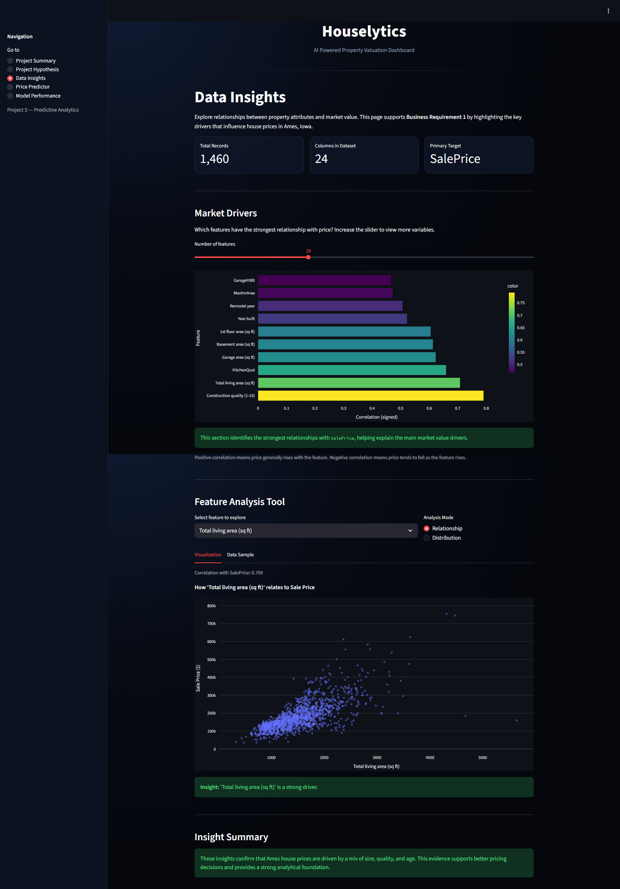

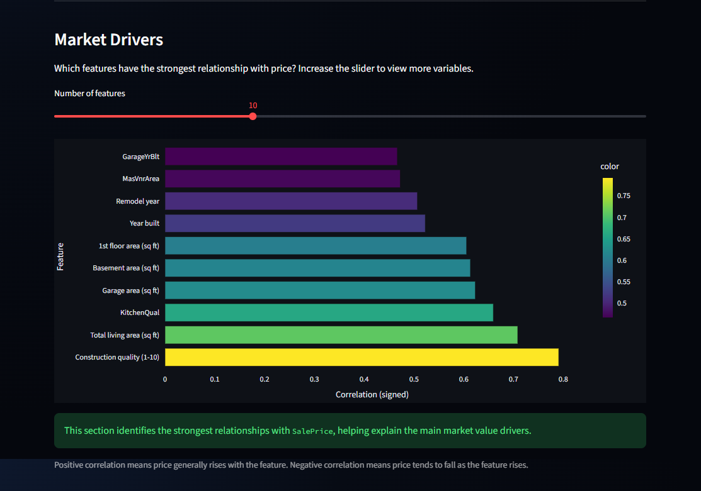

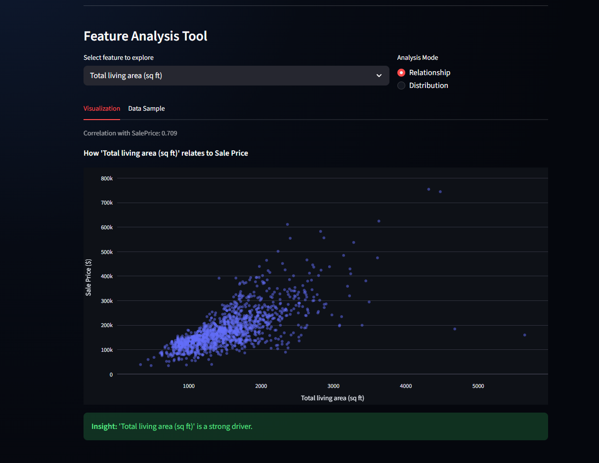

---

## Modeling Approach

The modeling stage was designed to meet **Business Requirement 2** by producing a practical regression-based pricing system.

### Baseline Model Comparison

Before selecting a final algorithm, multiple models were compared using the same train/test split.

| Model | Test R² | MAE | RMSE |
|---|---:|---:|---:|
| Linear Regression | 0.834 | 22,133 | 35,650 |
| Random Forest Regressor | 0.893 | 18,012 | 28,596 |
| Gradient Boosting Regressor | 0.889 | 17,785 | 29,229 |

### Interpretation

- **Linear Regression** provided a useful baseline but was weaker than the tree-based models.
- **Random Forest Regressor** delivered the strongest untuned baseline R².
- **Gradient Boosting Regressor** also performed strongly and offered more direct control through tuning.

### Final Model Selection

Although Random Forest achieved the strongest baseline score, **Gradient Boosting Regressor** was selected for further optimisation because:

- It performed strongly at baseline.
- It is well suited to structured tabular data.
- It can model non-linear relationships.
- It provides flexible hyperparameter control.
- It offered a strong candidate for performance gains through tuning.

### Hyperparameter Tuning Strategy

A **GridSearchCV** process was used to improve the baseline Gradient Boosting model.

The tuning strategy tested six hyperparameters:

- `n_estimators`
- `max_depth`
- `learning_rate`
- `min_samples_split`
- `min_samples_leaf`
- `max_features`

Each parameter was tested with multiple values to identify a stronger-performing final configuration.

### Best Parameters Found

- `learning_rate = 0.1`
- `max_depth = 3`
- `max_features = "sqrt"`
- `min_samples_leaf = 2`
- `min_samples_split = 2`
- `n_estimators = 300`

### Cross-Validated Tuning Score

- **Best Cross-Validated R²:** `0.8749`

### Final Model Performance

The final tuned model achieved:

- **Train R²:** `0.978`
- **Test R²:** `0.902`
- **Test MAE:** `16,953`
- **Test RMSE:** `27,472`

### Tuning Outcome

The tuned model improved on the untuned Gradient Boosting baseline:

- Baseline Gradient Boosting Test R²: **0.889**
- Tuned Gradient Boosting Test R²: **0.902**

The tuned model also improved error metrics and outperformed the baseline untuned Gradient Boosting model.

This demonstrates that the tuning process produced a measurable performance gain and strengthened the predictive business case.

---

## Dashboard Design

The dashboard was intentionally designed for a **non-technical end user**.

The main design goals were:

- Clarity.
- Business relevance.
- Guided navigation.
- Strong separation between analysis and prediction tasks.
- Visible trust signals through model performance reporting.

### Navigation

The app uses a structured navigation flow so the user can move through the project logically:

1. Understand the project context.
2. Review hypotheses.
3. Explore data insights.
4. Estimate property values.
5. Review model performance.

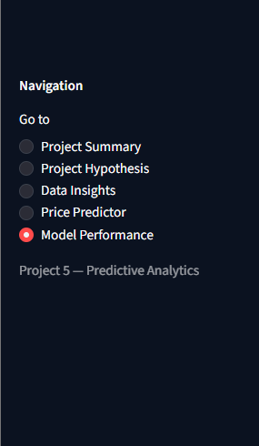

---

### Page 1: Project Summary

**Purpose:**  
Introduce the project, client context, stakeholder goals, and business requirements.

**Main Content:**

- Project overview.
- Client and context.
- Stakeholder goals.
- Business requirements.
- Dashboard guidance.
- Project scope and limitations.

**Business Role:**  
Helps a new user understand the problem before interacting with the analytical and predictive pages.

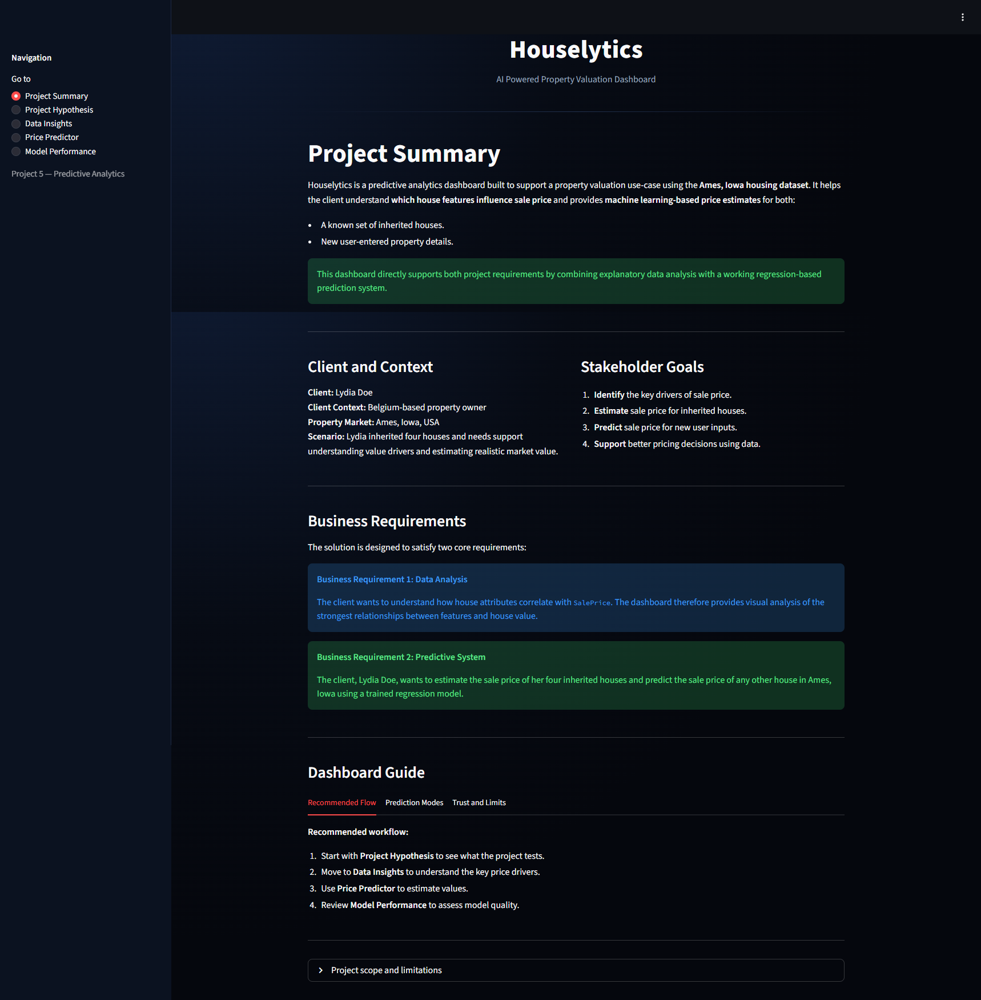

---

### Page 2: Project Hypothesis and Validation

**Purpose:**  
Present the three project hypotheses and test them using visual and statistical evidence.

**Main Content:**

- Three business-focused hypotheses.
- Charts for each hypothesis.
- Correlation values.
- Conclusion messages.
- Business takeaways.
- Executive summary.

**Business Role:**  
Shows that the project does not rely on guesswork and that the value-driver assumptions are supported by data.


---

### Page 3: Data Insights

**Purpose:**  
Support Business Requirement 1 through interactive data exploration.

**Main Content:**

- High-level dataset statistics.
- Top correlated feature view.
- Market drivers chart.
- Feature analysis tool.
- Distribution mode.
- Relationship mode.
- Historical data sample table.
- Insight summary.

**Business Role:**  
Helps the user identify the strongest relationships with `SalePrice` and better understand how important variables behave.


---

### Page 4: Property Valuation Tool

**Purpose:**  
Support Business Requirement 2 through direct price prediction workflows.

**Main Content:**

- Quick Estimate tab.
- Detailed Analysis tab.
- Inherited Portfolio Appraisal section.
- Metadata table for inherited records.
- Result cards with disclaimer guidance.

**Business Role:**  
Provides practical pricing estimates for both single properties and Lydia’s four-house portfolio.

#### Quick Estimate

A fast workflow using fewer, high-impact features.

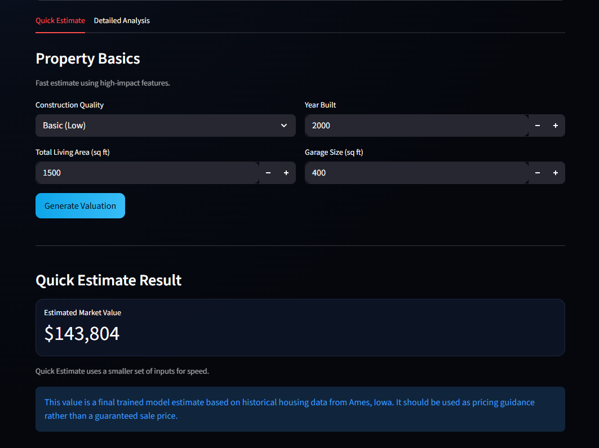

#### Detailed Analysis

A richer estimate using a broader feature set.

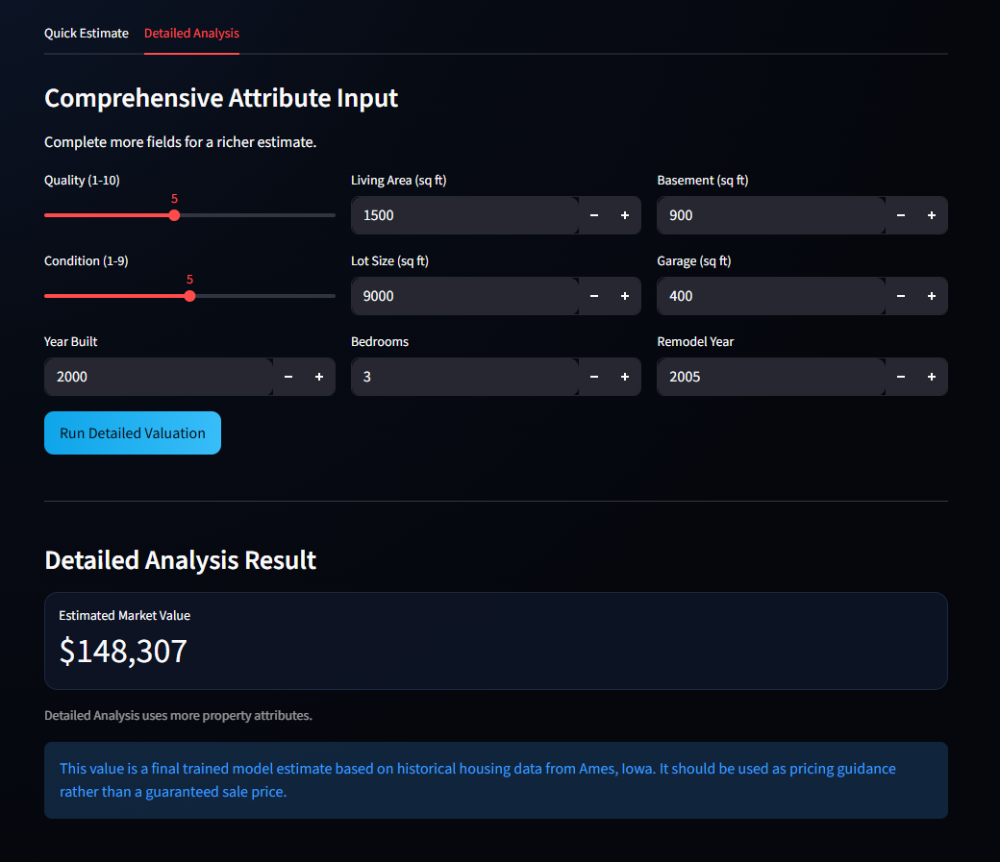

#### Overview

A top-level view of the valuation page structure.

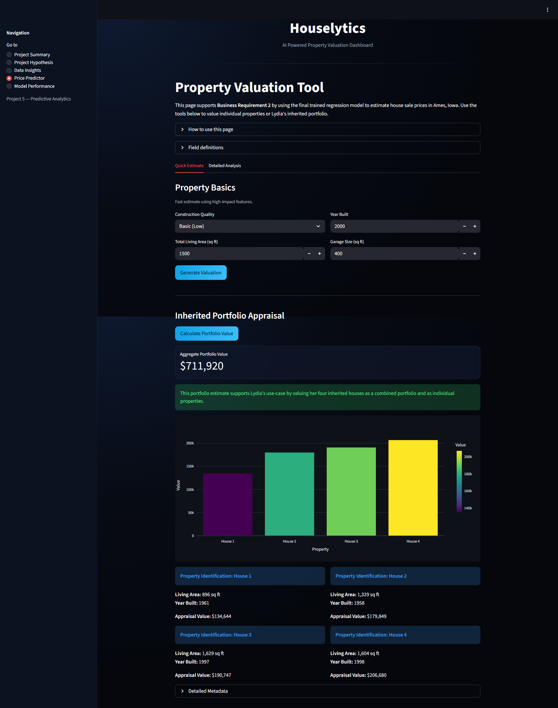

#### Inherited Portfolio Appraisal

Batch valuation for Lydia’s inherited houses, including aggregate and individual views.

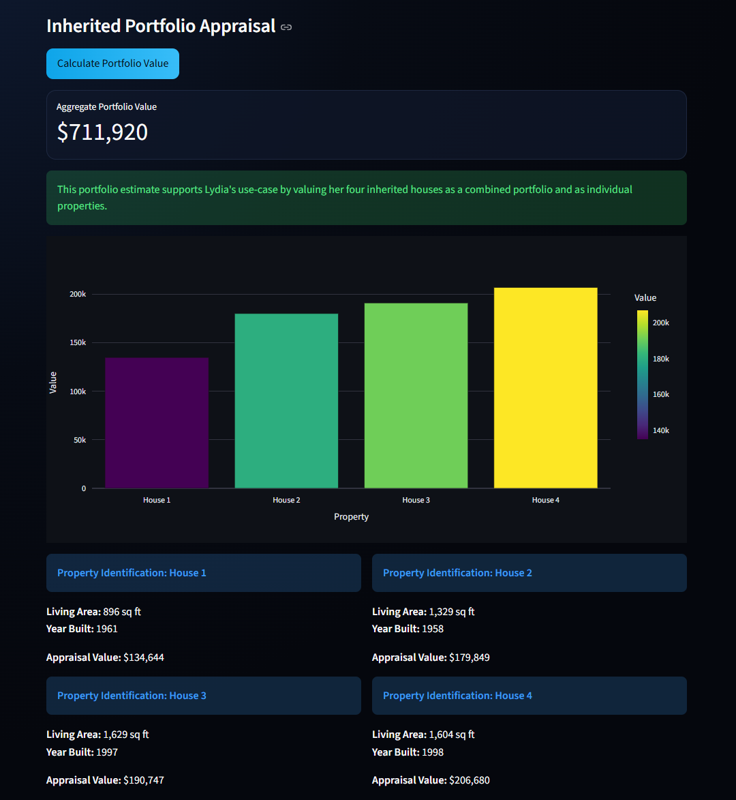

---

### Page 5: Model Performance

**Purpose:**  
Show whether the model performs strongly enough to support the predictive use-case.

**Main Content:**

- Train R².
- Test R².
- MAE.
- RMSE.
- Actual vs Predicted chart.
- Residual plot.
- Feature importance chart.
- Final model assessment message.

**Business Role:**  
Provides transparency and trust by showing how well the model performs on unseen data.

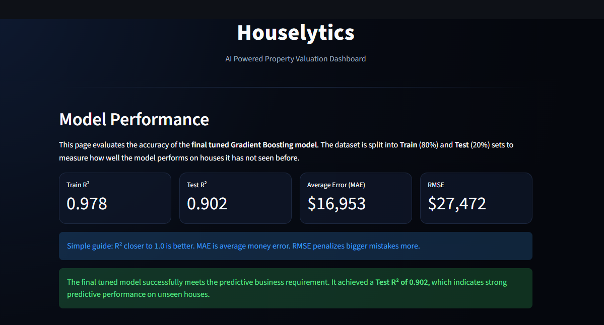

#### Actual vs Predicted

This visual compares real house prices with model predictions. The closer points are to the diagonal reference line, the stronger the predictive alignment.

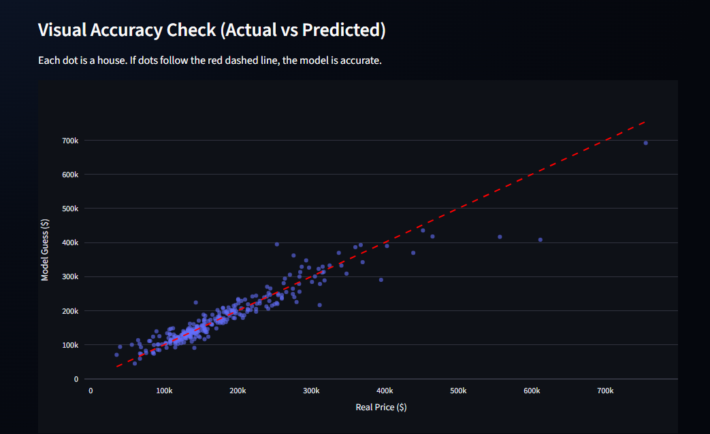

#### Residual Analysis

The residual plot helps show whether errors are balanced or reveal obvious pricing bias.

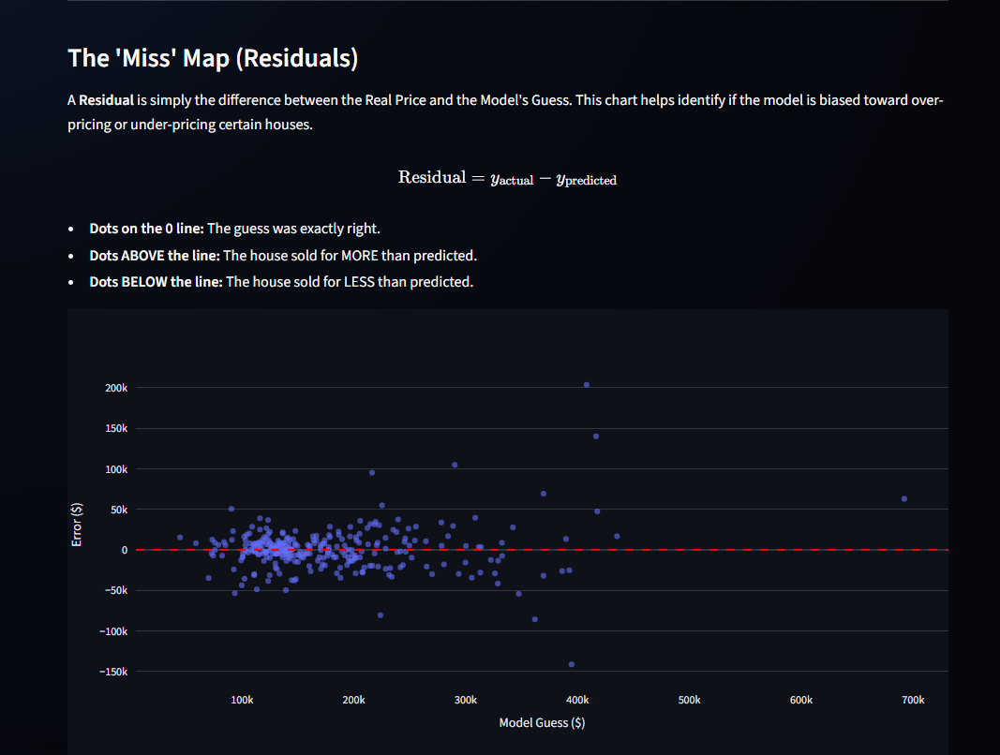

#### Feature Importance

This chart highlights the strongest predictors used by the final model.

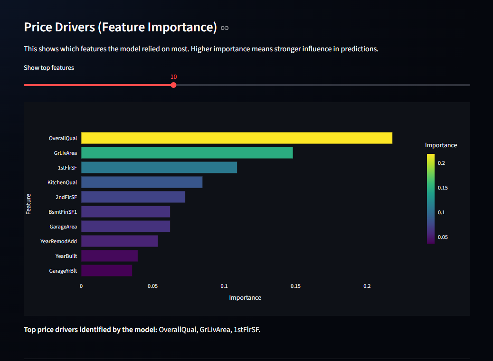

---

## Key Features

### Core Features

- A structured multi-page dashboard.
- A business-focused project summary.
- A hypothesis-driven validation page.
- An interactive data insights page.
- A quick estimate prediction workflow.
- A detailed analysis prediction workflow.
- An inherited portfolio appraisal workflow.
- A model performance transparency page.

### User Experience Features

- Clear page guidance.
- Beginner-friendly labels.
- Interactive controls.
- Explanatory captions and messages.
- Pricing disclaimers.
- Responsive charts.
- Cached data and model loading for smoother interaction.

### Technical Features

- Cleaned and aligned feature frames.
- A trained and tuned regression model.
- Batch prediction support for inherited portfolio data.
- Feature importance reporting.
- Robust input-to-model alignment through preprocessing helpers.

---

## Future Enhancements

Potential future improvements include:

- Downloadable valuation reports.
- Exportable prediction summaries.
- Side-by-side comparison of multiple user-defined properties.
- Additional feature explanation tooltips.
- More advanced model comparison reports within the dashboard.
- Optional confidence interval guidance for predictions.

---

## Technologies Used

### Language

- Python.

### Dashboard Framework

- Streamlit.

### Data Analysis and ML Libraries

- Pandas.
- NumPy.
- scikit-learn.
- Plotly.
- Joblib.

### Development Tools

- Jupyter Notebook.
- Git.
- GitHub.
- VS Code.

### Deployment

- Heroku.

---

## Project Structure

```text
.
├── app.py
├── Procfile
├── requirements.txt
├── setup.sh
├── .python-version
├── README.md
├── app_pages/
│   ├── summary.py
│   ├── hypothesis.py
│   ├── insights.py
│   ├── predictor.py
│   └── performance.py
├── data/
│   ├── raw/
│   │   ├── house_prices_records.csv
│   │   └── inherited_houses.csv
│   ├── processed/
│   │   └── clean_train.csv
│   └── metadata/
│       └── house-metadata.txt
├── notebooks/
│   ├── 01_data_understanding.ipynb
│   ├── 02_data_cleaning.ipynb
│   ├── 03_data_analysis.ipynb
│   └── 04_modeling.ipynb
├── src/
│   ├── preprocess.py
│   ├── house_price_model.pkl
│   └── model_report.json
└── docs/
    └── screenshots/
```

### Folder and File Purpose

- **app_pages/**: Streamlit page modules used by the main app.
- **data/raw/**: Original source files, including the inherited house data.
- **data/processed/**: The cleaned training dataset used for analysis and prediction.
- **data/metadata/**: Supporting descriptive metadata for the dataset.
- **notebooks/**: The notebook workflow for understanding, cleaning, analysing, and modeling.
- **src/**: Preprocessing helpers, the trained model, and supporting model metadata.
- **docs/screenshots/**: README image assets.

---

## Testing and Validation

Testing is documented as both a functional dashboard check and a data science workflow validation.

### Manual Testing

| Feature | Test Performed | Expected Result | Outcome |
|---|---|---|---|
| App launch | Open the deployed app. | Dashboard loads successfully. | Pass |
| Navigation | Visit each dashboard page. | All pages load without error. | Pass |
| Project Summary | Review sections and tabs. | Context and requirements display clearly. | Pass |
| Project Hypothesis | Load the page and inspect charts. | Hypotheses and conclusions render correctly. | Pass |
| Data Insights | Change the slider and select different features. | Charts and values update correctly. | Pass |
| Feature Analysis | Switch between Relationship and Distribution modes. | The plot updates correctly. | Pass |
| Quick Estimate | Enter values and click the valuation button. | A prediction is returned. | Pass |
| Detailed Analysis | Enter detailed values and run valuation. | A prediction is returned. | Pass |
| Inherited Portfolio | Click the portfolio valuation button. | Aggregate and individual values are shown. | Pass |
| Model Performance | Load the performance page. | Metrics and charts display correctly. | Pass |
| Actual vs Predicted | Review chart rendering. | The scatter plot renders correctly. | Pass |
| Residual Plot | Review chart rendering. | The residual plot renders correctly. | Pass |
| Feature Importance | Adjust the feature display controls if used. | The chart updates correctly. | Pass |

### Notebook Validation

The notebook workflow was used to validate each major stage.

#### 01 Data Understanding

- Reviewed structure, target, missing values, and data quality.

#### 02 Data Cleaning

- Documented the missing-value strategy and feature engineering decisions.

#### 03 Data Analysis

- Analysed distribution, correlations, and key pricing relationships.

#### 04 Modeling

- Compared baseline models.
- Tuned the selected model.
- Evaluated final model metrics.
- Saved the trained model for dashboard use.

### Code Quality Checks

- Key application files were reviewed and refined to improve consistency, clarity, and robustness.
- Streamlit chart rendering helpers were standardised across pages.
- Defensive checks were added in key places.
- Flake8 issues were addressed during development.
- Redundant and outdated notebook code blocks were cleaned up as part of project refinement.

### Known Limitations

- Predictions are estimates, not guaranteed sale prices.
- The project is based on historical Ames, Iowa housing data.
- Unusual market conditions may affect real-world pricing.
- The model should be treated as guidance rather than a final appraisal authority.

---

## Deployment

### Heroku Deployment

The application was deployed to Heroku using Git-based deployment.

### Required Deployment Files

The project uses the following deployment-support files:

- `Procfile`
- `setup.sh`
- `requirements.txt`
- `.python-version`

The `Procfile` starts the Streamlit application through `setup.sh`, which creates the required Streamlit server configuration for the Heroku environment before launching `app.py`.

### Deployment Steps

- Ensure the project is committed to Git.
- Create a Heroku app.
- Add the Heroku Git remote.
- Push the `main` branch to Heroku.
- Scale the web dyno if required.
- Open the deployed app and test all pages.

### Example Deployment Flow

```bash
heroku create
git push heroku main
heroku ps:scale web=1
heroku open
```

### Deployment Verification

After deployment, the following were checked:

- The app opens successfully.
- Navigation works.
- All pages render.
- Prediction workflows return results.
- Portfolio valuation works.

### Local Development

To run the project locally:

1. **Clone the repository**

```bash
git clone https://github.com/boneyphilip/houselytics.git
cd houselytics
```

2. **Install dependencies**

```bash
pip install -r requirements.txt
```

3. **Run the app**

```bash
streamlit run app.py
```

The app will open in a local browser window.

---

## Credits

- **Dataset scenario and housing dataset context:** Code Institute predictive analytics project brief.
- **Python ecosystem libraries:** Pandas, NumPy, scikit-learn, Plotly, and Streamlit.
- **Deployment platform:** Heroku.
- **Development environment:** VS Code and Jupyter Notebook.

Any third-party tools, libraries, or documentation referenced during development were used as learning support and not copied as uncredited project work.

---

## Acknowledgements

- **Code Institute** for the project brief and learning structure.
- The course material that supported the machine learning, data analysis, and deployment workflow.
- Ongoing development feedback that helped improve both the technical implementation and the documentation quality of the project.

---

## Final Conclusion

Houselytics successfully delivers a business-focused predictive analytics solution for the Ames, Iowa housing market.

The project meets the two core business requirements by:

- Identifying the strongest drivers of sale price through data analysis and visualisation.
- Providing a practical regression-based prediction system for both single-property and portfolio-level valuation.

The final tuned model demonstrates strong predictive performance on unseen data, and the Streamlit dashboard presents this functionality in a way that is accessible to a non-technical user. The result is a professional, evidence-based decision-support tool rather than a simple coding exercise.